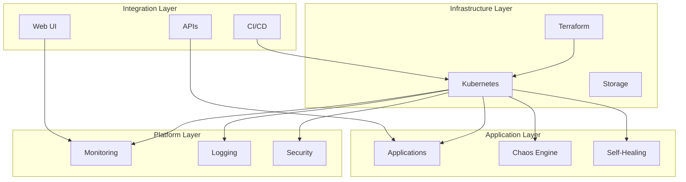

# 🔧 System Components

## Core Components Overview

The self-healing infrastructure consists of several key components that work together to provide a resilient, automated system.

### Component Architecture



## 1. Infrastructure Components

### Terraform Infrastructure
**Purpose**: Infrastructure as Code for provisioning and managing cloud resources

**Key Features**:
- Declarative infrastructure definition
- Version-controlled infrastructure changes
- Automated resource provisioning
- Cost optimization and management

**Configuration**:
```hcl
# Infrastructure modules
module "kubernetes_cluster" {
  source = "./modules/kubernetes"
  
  cluster_name = "self-healing-cluster"
  node_count   = 3
  node_type    = "t3.medium"
  
  tags = {
    Environment = "production"
    Project     = "self-healing-infrastructure"
  }
}

module "monitoring_stack" {
  source = "./modules/monitoring"
  
  prometheus_retention = "15d"
  grafana_admin_password = var.grafana_password
  
  depends_on = [module.kubernetes_cluster]
}
```

### Kubernetes Cluster
**Purpose**: Container orchestration and management platform

**Components**:
- **Control Plane**: API server, scheduler, controller manager
- **Worker Nodes**: Application pods and workloads
- **etcd**: Distributed key-value store
- **kubelet**: Node agent for pod management

**Configuration**:
```yaml
# Cluster configuration
apiVersion: v1
kind: ConfigMap
metadata:
  name: cluster-config
  namespace: kube-system
data:
  cluster-name: "self-healing-cluster"
  environment: "production"
  auto-scaling: "enabled"
  monitoring: "enabled"
```

## 2. Monitoring Components

### Prometheus
**Purpose**: Metrics collection, storage, and querying

**Features**:
- Time-series database
- Powerful query language (PromQL)
- Service discovery
- Alerting rules

**Configuration**:
```yaml
# Prometheus configuration
apiVersion: v1
kind: ConfigMap
metadata:
  name: prometheus-config
  namespace: monitoring
data:
  prometheus.yml: |
    global:
      scrape_interval: 15s
      evaluation_interval: 15s
    
    scrape_configs:
      - job_name: 'kubernetes-pods'
        kubernetes_sd_configs:
          - role: pod
        relabel_configs:
          - source_labels: [__meta_kubernetes_pod_annotation_prometheus_io_scrape]
            action: keep
            regex: true
```

### Grafana
**Purpose**: Data visualization and dashboard creation

**Features**:
- Rich dashboard creation
- Multiple data source support
- Alerting and notifications
- User management

**Dashboards**:
- **Cluster Overview**: Node status, resource usage
- **Application Metrics**: Response times, error rates
- **Infrastructure Health**: System performance
- **Chaos Engineering**: Experiment results

### AlertManager
**Purpose**: Alert routing and notification management

**Features**:
- Alert deduplication
- Grouping and routing
- Multiple notification channels
- Silence management

**Configuration**:
```yaml
# AlertManager configuration
apiVersion: v1
kind: ConfigMap
metadata:
  name: alertmanager-config
  namespace: monitoring
data:
  alertmanager.yml: |
    global:
      slack_api_url: 'https://hooks.slack.com/services/YOUR/SLACK/WEBHOOK'
    
    route:
      group_by: ['alertname']
      group_wait: 10s
      group_interval: 10s
      repeat_interval: 1h
      receiver: 'slack-notifications'
    
    receivers:
    - name: 'slack-notifications'
      slack_configs:
      - channel: '#alerts'
        title: '{{ template "slack.title" . }}'
        text: '{{ template "slack.text" . }}'
```

## 3. Self-Healing Components

### Self-Healing Controller
**Purpose**: Automated failure detection and recovery

**Core Logic**:
```python
class SelfHealingController:
    def __init__(self):
        self.health_check_interval = 30
        self.node_failure_threshold = 3
        self.pod_restart_threshold = 5
        self.slack_webhook = os.getenv('SLACK_WEBHOOK_URL')
    
    def monitor_cluster(self):
        """Monitor cluster health and trigger recovery actions"""
        while True:
            try:
                # Check node health
                self.check_node_health()
                
                # Check pod health
                self.check_pod_health()
                
                # Check service health
                self.check_service_health()
                
                time.sleep(self.health_check_interval)
            except Exception as e:
                self.send_alert(f"Monitoring error: {e}")
    
    def check_node_health(self):
        """Check node status and trigger recovery if needed"""
        nodes = self.k8s_client.list_node()
        for node in nodes.items:
            if node.status.conditions:
                for condition in node.status.conditions:
                    if condition.type == "Ready" and condition.status == "False":
                        self.handle_node_failure(node)
    
    def handle_node_failure(self, node):
        """Handle node failure by cordoning and draining"""
        try:
            # Cordon the node
            self.k8s_client.patch_node(
                name=node.metadata.name,
                body={"spec": {"unschedulable": True}}
            )
            
            # Drain the node
            self.drain_node(node.metadata.name)
            
            # Send notification
            self.send_alert(f"Node {node.metadata.name} has been cordoned and drained")
            
        except Exception as e:
            self.send_alert(f"Failed to handle node failure: {e}")
```

### Health Check Service
**Purpose**: Comprehensive health monitoring

**Health Checks**:
- **Liveness Probes**: Application responsiveness
- **Readiness Probes**: Service availability
- **Startup Probes**: Application startup status

**Configuration**:
```yaml
# Health check configuration
apiVersion: apps/v1
kind: Deployment
metadata:
  name: health-check-service
spec:
  template:
    spec:
      containers:
      - name: app
        image: my-app:latest
        livenessProbe:
          httpGet:
            path: /health
            port: 8080
          initialDelaySeconds: 30
          periodSeconds: 10
        readinessProbe:
          httpGet:
            path: /ready
            port: 8080
          initialDelaySeconds: 5
          periodSeconds: 5
        startupProbe:
          httpGet:
            path: /startup
            port: 8080
          failureThreshold: 30
          periodSeconds: 10
```

## 4. Chaos Engineering Components

### Chaos Mesh
**Purpose**: Chaos engineering platform for failure injection

**Experiment Types**:
- **Pod Chaos**: Pod failure, pod kill
- **Network Chaos**: Network delay, network loss
- **IO Chaos**: IO delay, IO error
- **Kernel Chaos**: Kernel panic, memory corruption

**Configuration**:
```yaml
# Chaos experiment configuration
apiVersion: chaos-mesh.org/v1alpha1
kind: PodChaos
metadata:
  name: pod-failure-experiment
spec:
  action: pod-failure
  mode: one
  selector:
    namespaces: [default]
    labelSelectors:
      app: test-app
  duration: 30s
  scheduler:
    cron: "@every 10m"
```

### Chaos Dashboard
**Purpose**: Visualize and manage chaos experiments

**Features**:
- Experiment scheduling
- Real-time monitoring
- Result analysis
- Experiment history

## 5. CI/CD Components

### GitHub Actions
**Purpose**: Automated build, test, and deployment pipeline

**Workflow Stages**:
1. **Build**: Compile and package applications
2. **Test**: Run unit and integration tests
3. **Security Scan**: Vulnerability scanning
4. **Deploy**: Automated deployment to environments

**Configuration**:
```yaml
# GitHub Actions workflow
name: CI/CD Pipeline
on:
  push:
    branches: [main]
  pull_request:
    branches: [main]

jobs:
  build:
    runs-on: ubuntu-latest
    steps:
    - uses: actions/checkout@v4
    - name: Build application
      run: |
        docker build -t my-app:${{ github.sha }} .
        docker push my-app:${{ github.sha }}
  
  test:
    runs-on: ubuntu-latest
    needs: build
    steps:
    - name: Run tests
      run: |
        kubectl apply -f kubernetes/test-app/
        kubectl wait --for=condition=ready pod -l app=test-app
        kubectl exec test-app -- npm test
  
  deploy:
    runs-on: ubuntu-latest
    needs: [build, test]
    steps:
    - name: Deploy to production
      run: |
        kubectl set image deployment/my-app my-app=my-app:${{ github.sha }}
        kubectl rollout status deployment/my-app
```

## 6. Security Components

### RBAC (Role-Based Access Control)
**Purpose**: Fine-grained access control

**Configuration**:
```yaml
# RBAC configuration
apiVersion: rbac.authorization.k8s.io/v1
kind: ClusterRole
metadata:
  name: self-healing-role
rules:
- apiGroups: [""]
  resources: ["pods", "nodes", "services"]
  verbs: ["get", "list", "watch", "create", "update", "patch", "delete"]
- apiGroups: ["apps"]
  resources: ["deployments", "replicasets"]
  verbs: ["get", "list", "watch", "create", "update", "patch", "delete"]
```

### Network Policies
**Purpose**: Micro-segmentation and network security

**Configuration**:
```yaml
# Network policy
apiVersion: networking.k8s.io/v1
kind: NetworkPolicy
metadata:
  name: default-deny
  namespace: default
spec:
  pod_selector: {}
  policy_types:
  - Ingress
  - Egress
```

### Secrets Management
**Purpose**: Secure credential and secret storage

**Configuration**:
```yaml
# Secret configuration
apiVersion: v1
kind: Secret
metadata:
  name: app-secrets
type: Opaque
data:
  database-url: <base64-encoded-url>
  api-key: <base64-encoded-key>
```

## Component Interactions

### Data Flow
1. **Monitoring**: Prometheus collects metrics from all components
2. **Analysis**: Self-healing controller analyzes metrics for anomalies
3. **Detection**: Failures are detected through health checks and metrics
4. **Recovery**: Automated recovery actions are triggered
5. **Notification**: Alerts are sent via Slack/email
6. **Documentation**: All actions are logged for audit

### Event Handling
- **Node Failure**: Cordon, drain, and replace node
- **Pod Crash**: Restart pod or scale deployment
- **Service Unavailable**: Restart service or failover
- **Resource Exhaustion**: Scale resources or migrate workloads

## Performance Characteristics

### Scalability
- **Horizontal Scaling**: Auto-scaling based on metrics
- **Vertical Scaling**: Resource limits and requests
- **Load Balancing**: Service mesh for traffic distribution

### Reliability
- **High Availability**: Multi-zone deployment
- **Fault Tolerance**: Redundant components
- **Disaster Recovery**: Backup and restore procedures

### Monitoring
- **Real-time Metrics**: Sub-second metric collection
- **Alerting**: Proactive issue detection
- **Logging**: Comprehensive audit trails
