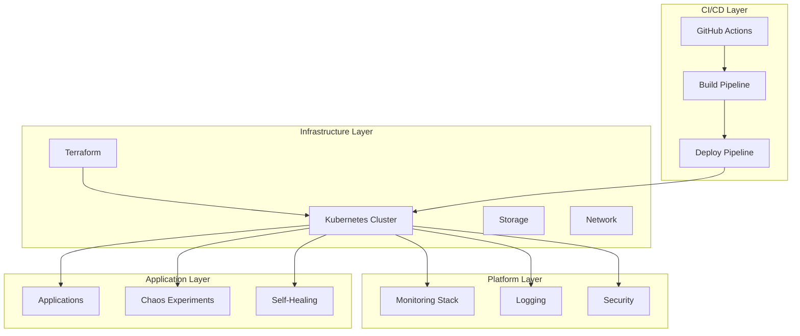
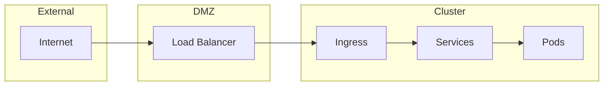

# 🏗️ Architecture Overview

## System Architecture

The self-healing infrastructure is built on a modern, cloud-native architecture that prioritizes resilience, scalability, and automation.

### High-Level Architecture

## Core Components

### 1. Infrastructure Management
- **Terraform**: Infrastructure as Code for provisioning and managing cloud resources
- **Kubernetes**: Container orchestration platform
- **Storage**: Persistent volumes and storage classes
- **Network**: Service mesh and network policies

### 2. Monitoring & Observability
- **Prometheus**: Metrics collection and storage
- **Grafana**: Visualization and dashboards
- **AlertManager**: Alert routing and notification
- **Jaeger**: Distributed tracing

### 3. Self-Healing System
- **Controller**: Python-based monitoring and recovery logic
- **Health Checks**: Automated health monitoring
- **Recovery Actions**: Automatic failure recovery
- **Notifications**: Slack integration for alerts

### 4. Chaos Engineering
- **Chaos Mesh**: Chaos engineering platform
- **Experiments**: Predefined chaos scenarios
- **Scheduling**: Automated chaos testing
- **Analysis**: Impact assessment and reporting

## Design Principles

### 1. Resilience First
- **Redundancy**: Multiple instances and failover mechanisms
- **Circuit Breakers**: Automatic failure isolation
- **Graceful Degradation**: System continues operating with reduced functionality

### 2. Automation Everywhere
- **Infrastructure as Code**: All infrastructure defined in code
- **Continuous Deployment**: Automated deployment pipeline
- **Self-Healing**: Automatic problem detection and resolution

### 3. Observability
- **Metrics**: Comprehensive system metrics
- **Logging**: Structured logging across all components
- **Tracing**: Distributed request tracing
- **Alerting**: Proactive alerting for issues

### 4. Security by Design
- **RBAC**: Role-based access control
- **Network Policies**: Micro-segmentation
- **Secrets Management**: Secure credential handling
- **Compliance**: Security and compliance standards

## Technology Stack

| Component | Technology | Purpose |
|-----------|------------|---------|
| **Container Orchestration** | Kubernetes | Container management and scaling |
| **Infrastructure as Code** | Terraform | Infrastructure provisioning |
| **Monitoring** | Prometheus + Grafana | Metrics and visualization |
| **Chaos Engineering** | Chaos Mesh | Failure injection and testing |
| **CI/CD** | GitHub Actions | Automated deployment |
| **Programming** | Python | Self-healing controller |
| **Configuration** | YAML/JSON | Resource definitions |

## Scalability Considerations

### Horizontal Scaling
- **Auto-scaling**: Kubernetes HPA for automatic scaling
- **Load Balancing**: Service mesh for traffic distribution
- **Database Scaling**: Read replicas and sharding

### Vertical Scaling
- **Resource Limits**: CPU and memory limits
- **Resource Requests**: Guaranteed resources
- **Node Scaling**: Cluster node management

## Security Architecture

### Network Security

### Access Control
- **Authentication**: OIDC integration
- **Authorization**: RBAC policies
- **Audit Logging**: Comprehensive audit trails
- **Secret Management**: Encrypted secrets storage

## Performance Characteristics

### Latency
- **API Response Time**: < 100ms for 95th percentile
- **Database Queries**: < 50ms for read operations
- **Service Mesh**: < 10ms overhead

### Throughput
- **Request Rate**: 10,000+ requests/second
- **Concurrent Users**: 1,000+ simultaneous users
- **Data Processing**: 1GB+ per minute

### Availability
- **Uptime**: 99.9% availability target
- **Recovery Time**: < 30 seconds for most failures
- **Data Durability**: 99.999999% (11 nines)

## Disaster Recovery

### Backup Strategy
- **Database Backups**: Daily automated backups
- **Configuration Backups**: Version-controlled configurations
- **Data Replication**: Cross-region replication

### Recovery Procedures
- **RTO (Recovery Time Objective)**: 4 hours
- **RPO (Recovery Point Objective)**: 1 hour
- **Failover**: Automated failover to secondary region

## Cost Optimization

### Resource Optimization
- **Right-sizing**: Optimal resource allocation
- **Spot Instances**: Cost-effective compute resources
- **Storage Tiering**: Appropriate storage classes

### Monitoring and Alerts
- **Cost Alerts**: Budget monitoring and alerts
- **Resource Utilization**: Efficiency monitoring
- **Optimization Recommendations**: Automated suggestions
