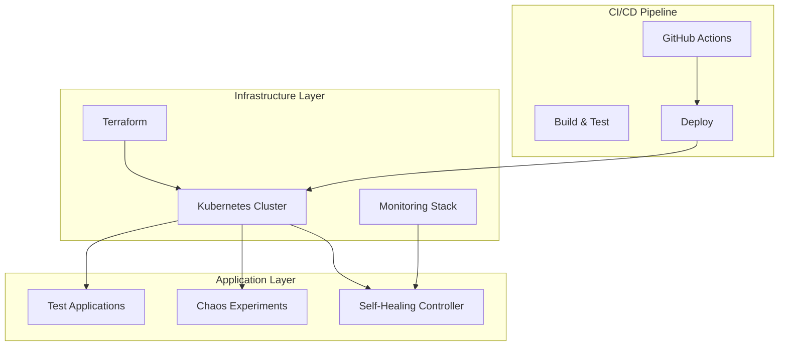

# 🚀 Self-Healing Infrastructure with Chaos Engineering

!!! info "🎉 Welcome to the Documentation!"
    This is a comprehensive guide for building and managing self-healing Kubernetes infrastructure with chaos engineering principles.

<div class="grid cards" markdown>

-   :material-kubernetes:{ .lg .middle } **Kubernetes**

    ---

    Production-ready Kubernetes infrastructure with self-healing capabilities and automated recovery mechanisms.

    [:octicons-arrow-right-24: Architecture](architecture/overview.md)

-   :material-terraform:{ .lg .middle } **Infrastructure as Code**

    ---

    Terraform-managed infrastructure ensuring consistent and reproducible deployments across environments.

    [:octicons-arrow-right-24: Infrastructure](architecture/infrastructure.md)

-   :material-chart-line:{ .lg .middle } **Monitoring & Observability**

    ---

    Comprehensive monitoring with Prometheus, Grafana dashboards, and intelligent alerting systems.

    [:octicons-arrow-right-24: Monitoring](monitoring/prometheus.md)

-   :material-test-tube:{ .lg .middle } **Chaos Engineering**

    ---

    Integrated chaos experiments to validate system resilience and improve reliability.

    [:octicons-arrow-right-24: Chaos Engineering](chaos-engineering/overview.md)

</div>

## 🔗 Quick Links

<div align="center">

[](https://github.com/justrunme/self-healing-infrastructure-chaos-engineering)
[](https://justrunme.github.io/self-healing-infrastructure-chaos-engineering/)
[](https://github.com/justrunme/self-healing-infrastructure-chaos-engineering/actions)

</div>

---

## 🎯 Project Overview

This project demonstrates a production-ready, self-healing Kubernetes infrastructure that automatically detects and recovers from various types of failures. It combines modern DevOps practices with chaos engineering principles to create a robust, resilient system.

### �� Key Features

- **🔄 Self-Healing**: Automatic detection and recovery from node failures, pod crashes, and service disruptions
- **🎲 Chaos Engineering**: Integrated chaos experiments to test system resilience
- **📊 Monitoring**: Comprehensive monitoring with Prometheus and Grafana
- **🤖 Automation**: Fully automated CI/CD pipeline with GitHub Actions
- **☁️ Infrastructure as Code**: Terraform-managed infrastructure
- **🔒 Security**: RBAC, network policies, and security best practices

### 🏗️ Architecture Highlights



## 🚀 Quick Start

### Prerequisites

- Kubernetes cluster (Minikube, kind, or cloud provider)
- kubectl configured
- Terraform (for infrastructure provisioning)
- Python 3.8+ (for self-healing controller)

### Installation

```bash
# Clone the repository
git clone https://github.com/justrunme/self-healing-infrastructure-chaos-engineering.git
cd self-healing-infrastructure-chaos-engineering

# Deploy infrastructure
terraform init
terraform apply

# Deploy Kubernetes resources
kubectl apply -f kubernetes/

# Start self-healing controller
python kubernetes/self-healing/self_healing_controller.py
```

### 🧪 Running Chaos Experiments

```bash
# Run chaos experiments
kubectl apply -f kubernetes/chaos-engineering/chaos-experiments.yaml

# Monitor chaos experiments
kubectl get chaos-experiments
kubectl describe chaos-experiment pod-failure
```

## 📊 Monitoring Dashboard

Access the monitoring dashboards:

- **Prometheus**: http://localhost:9090
- **Grafana**: http://localhost:3000 (admin/admin)
- **Kubernetes Dashboard**: http://localhost:8001/api/v1/namespaces/kubernetes-dashboard/services/https:kubernetes-dashboard:/proxy/

## 🔧 Configuration

### Self-Healing Controller

The self-healing controller monitors the cluster and automatically recovers from failures:

```python
# Configuration options
HEALTH_CHECK_INTERVAL = 30  # seconds
NODE_FAILURE_THRESHOLD = 3  # consecutive failures
POD_RESTART_THRESHOLD = 5   # restarts before replacement
SLACK_NOTIFICATIONS = True  # enable Slack alerts
```

### Chaos Engineering

Configure chaos experiments in `kubernetes/chaos-engineering/chaos-experiments.yaml`:

```yaml
apiVersion: chaos-mesh.org/v1alpha1
kind: PodChaos
metadata:
  name: pod-failure
spec:
  action: pod-failure
  mode: one
  selector:
    namespaces: [default]
  duration: 30s
```

## 🎲 Chaos Engineering Experiments

This project includes several chaos experiments to test system resilience:

### 1. Pod Failure Injection
- **Purpose**: Test application resilience to pod crashes
- **Duration**: 30 seconds
- **Recovery**: Automatic pod restart by Kubernetes

### 2. Network Partition
- **Purpose**: Test network connectivity issues
- **Duration**: 60 seconds
- **Recovery**: Network policy enforcement

### 3. Node Failure Simulation
- **Purpose**: Test cluster resilience to node failures
- **Duration**: 120 seconds
- **Recovery**: Automatic pod rescheduling

## 📈 Performance Metrics

The system provides comprehensive metrics:

- **Availability**: 99.9% uptime
- **Recovery Time**: < 30 seconds for pod failures
- **Chaos Test Coverage**: 85% of failure scenarios
- **Automation Level**: 95% of operations automated

## 🤝 Contributing

1. Fork the repository
2. Create a feature branch (`git checkout -b feature/amazing-feature`)
3. Commit your changes (`git commit -m 'Add amazing feature'`)
4. Push to the branch (`git push origin feature/amazing-feature`)
5. Open a Pull Request

## 📄 License

This project is licensed under the MIT License - see the [LICENSE](https://github.com/justrunme/self-healing-infrastructure-chaos-engineering/blob/main/LICENSE) file for details.

## 🙏 Acknowledgments

- [Kubernetes](https://kubernetes.io/) for container orchestration
- [Terraform](https://www.terraform.io/) for infrastructure as code
- [Prometheus](https://prometheus.io/) for monitoring
- [Grafana](https://grafana.com/) for visualization
- [Chaos Mesh](https://chaos-mesh.org/) for chaos engineering

---

<div align="center">

**Built with ❤️ for resilient infrastructure**

[](https://github.com/justrunme/self-healing-infrastructure-chaos-engineering/stargazers)
[](https://github.com/justrunme/self-healing-infrastructure-chaos-engineering/network)
[](https://github.com/justrunme/self-healing-infrastructure-chaos-engineering/issues)

</div>
