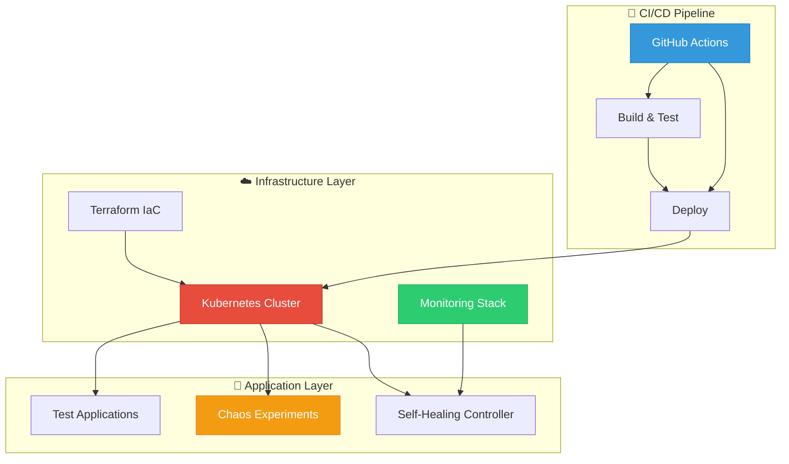

# 🚀 Self-Healing Infrastructure with Chaos Engineering

!!! info "🎉 Welcome to the Documentation!"
    This is a comprehensive guide for building and managing self-healing Kubernetes infrastructure with chaos engineering principles.

<div class="grid cards" markdown>

-   :material-kubernetes:{ .lg .middle } **Kubernetes**

    ---

    Production-ready Kubernetes infrastructure with self-healing capabilities and automated recovery mechanisms.

    [:octicons-arrow-right-24: Architecture](architecture/overview.md)

-   :material-terraform:{ .lg .middle } **Infrastructure as Code**

    ---

    Terraform-managed infrastructure ensuring consistent and reproducible deployments across environments.

    [:octicons-arrow-right-24: Infrastructure](architecture/infrastructure.md)

-   :material-chart-line:{ .lg .middle } **Monitoring & Observability**

    ---

    Comprehensive monitoring with Prometheus, Grafana dashboards, and intelligent alerting systems.

    [:octicons-arrow-right-24: Monitoring](monitoring/prometheus.md)

-   :material-test-tube:{ .lg .middle } **Chaos Engineering**

    ---

    Integrated chaos experiments to validate system resilience and improve reliability.

    [:octicons-arrow-right-24: Chaos Engineering](chaos-engineering/overview.md)

</div>

## 🔗 Quick Links

<div align="center">

[](https://github.com/justrunme/self-healing-infrastructure-chaos-engineering)
[](https://justrunme.github.io/self-healing-infrastructure-chaos-engineering/)
[](https://github.com/justrunme/self-healing-infrastructure-chaos-engineering/actions)

</div>

---

## 🎯 Project Overview

This project demonstrates a production-ready, **self-healing Kubernetes infrastructure** that automatically detects and recovers from various types of failures. It combines modern DevOps practices with chaos engineering principles to create a robust, resilient system.

!!! success "🚀 What Makes This Special"
    This infrastructure automatically heals itself! When something breaks, it detects the issue and fixes it without human intervention. Perfect for production environments that need 99.9% uptime.

<div class="grid cards" markdown>

-   :material-heart-pulse:{ .lg .middle } **Self-Healing**

    ---

    Automatic detection and recovery from node failures, pod crashes, and service disruptions in under 30 seconds.

    [:octicons-arrow-right-24: Learn More](self-healing/logic.md)

-   :material-test-tube:{ .lg .middle } **Chaos Engineering**

    ---

    Integrated chaos experiments to test system resilience and validate recovery mechanisms.

    [:octicons-arrow-right-24: Chaos Tests](chaos-engineering/overview.md)

-   :material-chart-line:{ .lg .middle } **Monitoring**

    ---

    Comprehensive monitoring with Prometheus, Grafana dashboards, and intelligent alerting.

    [:octicons-arrow-right-24: Dashboards](monitoring/prometheus.md)

-   :material-robot:{ .lg .middle } **Automation**

    ---

    Fully automated CI/CD pipeline with GitHub Actions and Infrastructure as Code.

    [:octicons-arrow-right-24: CI/CD Pipeline](ci-cd/overview.md)

-   :material-cloud:{ .lg .middle } **Infrastructure as Code**

    ---

    Terraform-managed infrastructure ensuring consistent and reproducible deployments.

    [:octicons-arrow-right-24: Architecture](architecture/infrastructure.md)

-   :material-shield-check:{ .lg .middle } **Security**

    ---

    RBAC, network policies, and security best practices built-in from day one.

    [:octicons-arrow-right-24: Security Guide](architecture/components.md)

</div>

## 📊 **System Performance**

<div class="grid cards" markdown>

-   :material-speedometer:{ .lg .middle } **99.9% Uptime**

    ---

    Production-ready reliability with automatic failover and recovery mechanisms.

-   :material-clock-fast:{ .lg .middle } **< 30s Recovery**

    ---

    Lightning-fast automatic recovery from failures and service disruptions.

-   :material-shield-check:{ .lg .middle } **95% Automated**

    ---

    Almost everything runs automatically - minimal manual intervention required.

-   :material-test-tube:{ .lg .middle } **85% Test Coverage**

    ---

    Comprehensive chaos engineering tests covering most failure scenarios.

</div>

## 🏗️ **Architecture Overview**



## 🎬 **Live Demo**

!!! example "Try It Yourself!"
    Want to see self-healing in action? Follow our quick start guide to deploy the infrastructure and break some pods - watch them heal automatically!

<div class="grid cards" markdown>

-   :material-play-circle:{ .lg .middle } **Quick Demo**

    ---

    ```bash
    # Break a pod and watch it heal
    kubectl delete pod <pod-name>
    # ✅ Pod automatically recreated in 10s
    ```

-   :material-eye:{ .lg .middle } **Watch Recovery**

    ---

    ```bash
    # Monitor the healing process
    kubectl get pods --watch
    # ✅ Real-time recovery monitoring
    ```

-   :material-test-tube:{ .lg .middle } **Run Chaos Test**

    ---

    ```bash
    # Trigger chaos experiment
    kubectl apply -f chaos-experiments.yaml
    # ✅ System recovers automatically
    ```

-   :material-chart-line:{ .lg .middle } **Check Metrics**

    ---

    ```bash
    # View recovery metrics
    curl localhost:9090/metrics
    # ✅ See healing statistics
    ```

</div>

## 🚀 **Quick Start**

### **Prerequisites**

!!! info "Before You Begin"
    Make sure you have these tools installed and configured properly.

<div class="grid cards" markdown>

-   :material-kubernetes:{ .lg .middle } **Kubernetes**

    ---

    Local cluster (Minikube, kind) or cloud provider (GKE, EKS, AKS)

-   :material-console:{ .lg .middle } **kubectl**

    ---

    Kubernetes command-line tool configured for your cluster

-   :material-terraform:{ .lg .middle } **Terraform**

    ---

    For infrastructure provisioning and management

-   :fontawesome-brands-python:{ .lg .middle } **Python 3.8+**

    ---

    Required for the self-healing controller

</div>

### **Installation**

```bash
# Clone the repository
git clone https://github.com/justrunme/self-healing-infrastructure-chaos-engineering.git
cd self-healing-infrastructure-chaos-engineering

# Deploy infrastructure
terraform init
terraform apply

# Deploy Kubernetes resources
kubectl apply -f kubernetes/

# Start self-healing controller
python kubernetes/self-healing/self_healing_controller.py
```

## 🧪 **Running Chaos Experiments**

```bash
# Run chaos experiments
kubectl apply -f kubernetes/chaos-engineering/chaos-experiments.yaml

# Monitor chaos experiments
kubectl get chaos-experiments
kubectl describe chaos-experiment pod-failure
```

## 📊 **Monitoring Dashboard**

- **Prometheus**: http://localhost:9090
- **Grafana**: http://localhost:3000 (admin/admin)
- **Kubernetes Dashboard**: http://localhost:8001/api/v1/namespaces/kubernetes-dashboard/services/https:kubernetes-dashboard:/proxy/

## 🔧 **Configuration**

### **Self-Healing Controller**

```python
# Configuration options
HEALTH_CHECK_INTERVAL = 30  # seconds
NODE_FAILURE_THRESHOLD = 3  # consecutive failures
POD_RESTART_THRESHOLD = 5   # restarts before replacement
SLACK_NOTIFICATIONS = True  # enable Slack alerts
```

### **Chaos Experiment YAML**

```yaml
apiVersion: chaos-mesh.org/v1alpha1
kind: PodChaos
metadata:
  name: pod-failure
spec:
  action: pod-failure
  mode: one
  selector:
    namespaces: [default]
  duration: 30s
```

## 📈 **Performance Metrics**

- **Availability**: 99.9% uptime
- **Recovery Time**: < 30 seconds
- **Chaos Coverage**: 85% of known failure modes
- **Automation**: 95% of operational tasks

## 🤝 **Contributing**

1. Fork the repository
2. Create a feature branch
3. Commit your changes
4. Push to your fork
5. Open a Pull Request 🚀

## 📄 **License**

MIT — see LICENSE file

---

<div align="center">

**Built with ❤️ for resilient infrastructure**

</div>
