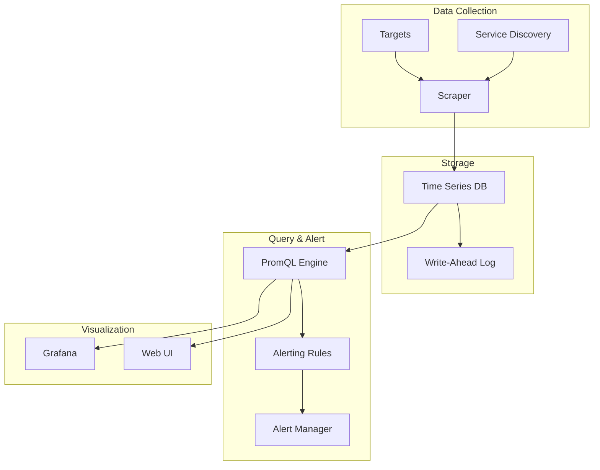

# 📊 Prometheus Monitoring

## Overview

Prometheus is a powerful open-source monitoring and alerting system designed for reliability and scalability. It collects metrics from monitored targets by scraping HTTP endpoints on these targets, stores the metrics locally, and provides a flexible query language (PromQL) for analyzing the data.

## Architecture



## Installation and Configuration

### 1. Helm Installation

```bash
# Add Prometheus Helm repository
helm repo add prometheus-community https://prometheus-community.github.io/helm-charts
helm repo update

# Install Prometheus with custom values
helm install prometheus prometheus-community/kube-prometheus-stack \
  --namespace monitoring \
  --create-namespace \
  --values prometheus-values.yaml
```

### 2. Custom Values Configuration

```yaml
# prometheus-values.yaml
prometheus:
  prometheusSpec:
    retention: 15d
    storageSpec:
      volumeClaimTemplate:
        spec:
          storageClassName: fast-ssd
          accessModes: ["ReadWriteOnce"]
          resources:
            requests:
              storage: 50Gi
    
    # Scrape configuration
    additionalScrapeConfigs:
      - job_name: 'kubernetes-pods'
        kubernetes_sd_configs:
          - role: pod
        relabel_configs:
          - source_labels: [__meta_kubernetes_pod_annotation_prometheus_io_scrape]
            action: keep
            regex: true
          - source_labels: [__meta_kubernetes_pod_annotation_prometheus_io_path]
            action: replace
            target_label: __metrics_path__
            regex: (.+)
          - source_labels: [__address__, __meta_kubernetes_pod_annotation_prometheus_io_port]
            action: replace
            regex: ([^:]+)(?::\d+)?;(\d+)
            replacement: $1:$2
            target_label: __address__
          - action: labelmap
            regex: __meta_kubernetes_pod_label_(.+)
          - source_labels: [__meta_kubernetes_namespace]
            action: replace
            target_label: kubernetes_namespace
          - source_labels: [__meta_kubernetes_pod_name]
            action: replace
            target_label: kubernetes_pod_name

grafana:
  adminPassword: "admin123"
  persistence:
    enabled: true
    storageClassName: fast-ssd
    size: 10Gi
  
  # Dashboard configuration
  dashboardProviders:
    dashboardproviders.yaml:
      apiVersion: 1
      providers:
        - name: 'default'
          orgId: 1
          folder: ''
          type: file
          disableDeletion: false
          editable: true
          options:
            path: /var/lib/grafana/dashboards/default
  
  dashboards:
    default:
      kubernetes-cluster:
        gnetId: 315
        revision: 3
        datasource: Prometheus
      kubernetes-pods:
        gnetId: 6417
        revision: 1
        datasource: Prometheus

alertmanager:
  alertmanagerSpec:
    retention: 120h
    storage:
      volumeClaimTemplate:
        spec:
          storageClassName: fast-ssd
          accessModes: ["ReadWriteOnce"]
          resources:
            requests:
              storage: 10Gi
```

### 3. Kubernetes Resources

```yaml
# kubernetes/monitoring/prometheus-config.yaml
apiVersion: v1
kind: ConfigMap
metadata:
  name: prometheus-config
  namespace: monitoring
data:
  prometheus.yml: |
    global:
      scrape_interval: 15s
      evaluation_interval: 15s
      external_labels:
        cluster: self-healing-cluster
        environment: production
    
    rule_files:
      - "alert_rules.yml"
    
    alerting:
      alertmanagers:
        - static_configs:
            - targets:
              - alertmanager:9093
    
    scrape_configs:
      # Kubernetes API server
      - job_name: 'kubernetes-apiservers'
        kubernetes_sd_configs:
          - role: endpoints
        scheme: https
        tls_config:
          ca_file: /var/run/secrets/kubernetes.io/serviceaccount/ca.crt
        bearer_token_file: /var/run/secrets/kubernetes.io/serviceaccount/token
        relabel_configs:
          - source_labels: [__meta_kubernetes_namespace, __meta_kubernetes_service_name, __meta_kubernetes_endpoint_port_name]
            action: keep
            regex: default;kubernetes;https
      
      # Kubernetes nodes
      - job_name: 'kubernetes-nodes'
        kubernetes_sd_configs:
          - role: node
        scheme: https
        tls_config:
          ca_file: /var/run/secrets/kubernetes.io/serviceaccount/ca.crt
        bearer_token_file: /var/run/secrets/kubernetes.io/serviceaccount/token
        relabel_configs:
          - action: labelmap
            regex: __meta_kubernetes_node_label_(.+)
      
      # Kubernetes pods
      - job_name: 'kubernetes-pods'
        kubernetes_sd_configs:
          - role: pod
        relabel_configs:
          - source_labels: [__meta_kubernetes_pod_annotation_prometheus_io_scrape]
            action: keep
            regex: true
          - source_labels: [__meta_kubernetes_pod_annotation_prometheus_io_path]
            action: replace
            target_label: __metrics_path__
            regex: (.+)
          - source_labels: [__address__, __meta_kubernetes_pod_annotation_prometheus_io_port]
            action: replace
            regex: ([^:]+)(?::\d+)?;(\d+)
            replacement: $1:$2
            target_label: __address__
          - action: labelmap
            regex: __meta_kubernetes_pod_label_(.+)
          - source_labels: [__meta_kubernetes_namespace]
            action: replace
            target_label: kubernetes_namespace
          - source_labels: [__meta_kubernetes_pod_name]
            action: replace
            target_label: kubernetes_pod_name
      
      # Self-healing controller
      - job_name: 'self-healing-controller'
        static_configs:
          - targets: ['self-healing-controller:8080']
        metrics_path: /metrics
        scrape_interval: 30s
      
      # Application metrics
      - job_name: 'application-metrics'
        kubernetes_sd_configs:
          - role: pod
        relabel_configs:
          - source_labels: [__meta_kubernetes_pod_label_app]
            action: keep
            regex: my-app
          - source_labels: [__meta_kubernetes_pod_annotation_prometheus_io_scrape]
            action: keep
            regex: true
          - source_labels: [__meta_kubernetes_pod_annotation_prometheus_io_port]
            action: replace
            regex: (.+)
            target_label: __address__
            replacement: $1:8080
```

## Alerting Rules

### 1. Node Alerts

```yaml
# kubernetes/monitoring/alert-rules.yaml
apiVersion: v1
kind: ConfigMap
metadata:
  name: prometheus-alerts
  namespace: monitoring
data:
  alert_rules.yml: |
    groups:
      - name: kubernetes.rules
        rules:
          # Node down alert
          - alert: NodeDown
            expr: up == 0
            for: 5m
            labels:
              severity: critical
            annotations:
              summary: "Node {{ $labels.instance }} is down"
              description: "Node {{ $labels.instance }} has been down for more than 5 minutes"
          
          # High CPU usage
          - alert: HighCPUUsage
            expr: 100 - (avg by(instance) (irate(node_cpu_seconds_total{mode="idle"}[5m])) * 100) > 80
            for: 5m
            labels:
              severity: warning
            annotations:
              summary: "High CPU usage on {{ $labels.instance }}"
              description: "CPU usage is above 80% for more than 5 minutes"
          
          # High memory usage
          - alert: HighMemoryUsage
            expr: (node_memory_MemTotal_bytes - node_memory_MemAvailable_bytes) / node_memory_MemTotal_bytes * 100 > 85
            for: 5m
            labels:
              severity: warning
            annotations:
              summary: "High memory usage on {{ $labels.instance }}"
              description: "Memory usage is above 85% for more than 5 minutes"
          
          # High disk usage
          - alert: HighDiskUsage
            expr: (node_filesystem_size_bytes - node_filesystem_free_bytes) / node_filesystem_size_bytes * 100 > 90
            for: 5m
            labels:
              severity: warning
            annotations:
              summary: "High disk usage on {{ $labels.instance }}"
              description: "Disk usage is above 90% for more than 5 minutes"
```

### 2. Pod Alerts

```yaml
# Pod-specific alerts
          # Pod restarting frequently
          - alert: PodRestartingFrequently
            expr: increase(kube_pod_container_status_restarts_total[1h]) > 5
            for: 2m
            labels:
              severity: warning
            annotations:
              summary: "Pod {{ $labels.pod }} is restarting frequently"
              description: "Pod {{ $labels.pod }} has restarted more than 5 times in the last hour"
          
          # Pod not ready
          - alert: PodNotReady
            expr: kube_pod_status_ready{condition="true"} == 0
            for: 5m
            labels:
              severity: critical
            annotations:
              summary: "Pod {{ $labels.pod }} is not ready"
              description: "Pod {{ $labels.pod }} has been not ready for more than 5 minutes"
          
          # Pod crash loop backoff
          - alert: PodCrashLoopBackOff
            expr: kube_pod_status_phase{phase="Running"} == 0 and kube_pod_status_phase{phase="Failed"} == 1
            for: 2m
            labels:
              severity: critical
            annotations:
              summary: "Pod {{ $labels.pod }} is in crash loop backoff"
              description: "Pod {{ $labels.pod }} is failing to start and is in crash loop backoff"
```

### 3. Application Alerts

```yaml
# Application-specific alerts
          # High error rate
          - alert: HighErrorRate
            expr: rate(http_requests_total{status=~"5.."}[5m]) / rate(http_requests_total[5m]) * 100 > 5
            for: 2m
            labels:
              severity: warning
            annotations:
              summary: "High error rate detected"
              description: "Error rate is above 5% for more than 2 minutes"
          
          # High response time
          - alert: HighResponseTime
            expr: histogram_quantile(0.95, rate(http_request_duration_seconds_bucket[5m])) > 1
            for: 5m
            labels:
              severity: warning
            annotations:
              summary: "High response time detected"
              description: "95th percentile response time is above 1 second for more than 5 minutes"
          
          # Service down
          - alert: ServiceDown
            expr: up{job="application-metrics"} == 0
            for: 1m
            labels:
              severity: critical
            annotations:
              summary: "Service is down"
              description: "Application service is not responding"
```

## PromQL Queries

### 1. Node Metrics

```promql
# CPU usage by node
100 - (avg by(instance) (irate(node_cpu_seconds_total{mode="idle"}[5m])) * 100)

# Memory usage by node
(node_memory_MemTotal_bytes - node_memory_MemAvailable_bytes) / node_memory_MemTotal_bytes * 100

# Disk usage by node
(node_filesystem_size_bytes - node_filesystem_free_bytes) / node_filesystem_size_bytes * 100

# Network traffic
rate(node_network_receive_bytes_total[5m])
rate(node_network_transmit_bytes_total[5m])
```

### 2. Pod Metrics

```promql
# Pod restart count
increase(kube_pod_container_status_restarts_total[1h])

# Pod resource usage
container_cpu_usage_seconds_total
container_memory_usage_bytes

# Pod status
kube_pod_status_phase

# Pod ready status
kube_pod_status_ready
```

### 3. Application Metrics

```promql
# Request rate
rate(http_requests_total[5m])

# Error rate
rate(http_requests_total{status=~"5.."}[5m]) / rate(http_requests_total[5m]) * 100

# Response time
histogram_quantile(0.95, rate(http_request_duration_seconds_bucket[5m]))

# Active connections
http_connections_active
```

### 4. Self-Healing Metrics

```promql
# Failures detected
self_healing_failures_detected_total

# Recovery attempts
self_healing_recoveries_attempted_total

# Recovery duration
histogram_quantile(0.95, self_healing_recovery_duration_seconds)

# Active failures
self_healing_active_failures
```

## Dashboards

### 1. Cluster Overview Dashboard

```json
{
  "dashboard": {
    "title": "Kubernetes Cluster Overview",
    "panels": [
      {
        "title": "Node CPU Usage",
        "type": "graph",
        "targets": [
          {
            "expr": "100 - (avg by (instance) (irate(node_cpu_seconds_total{mode=\"idle\"}[5m])) * 100)"
          }
        ]
      },
      {
        "title": "Node Memory Usage",
        "type": "graph",
        "targets": [
          {
            "expr": "(node_memory_MemTotal_bytes - node_memory_MemAvailable_bytes) / node_memory_MemTotal_bytes * 100"
          }
        ]
      },
      {
        "title": "Pod Status",
        "type": "stat",
        "targets": [
          {
            "expr": "kube_pod_status_phase"
          }
        ]
      }
    ]
  }
}
```

### 2. Application Dashboard

```json
{
  "dashboard": {
    "title": "Application Metrics",
    "panels": [
      {
        "title": "Request Rate",
        "type": "graph",
        "targets": [
          {
            "expr": "rate(http_requests_total[5m])"
          }
        ]
      },
      {
        "title": "Error Rate",
        "type": "graph",
        "targets": [
          {
            "expr": "rate(http_requests_total{status=~\"5..\"}[5m]) / rate(http_requests_total[5m]) * 100"
          }
        ]
      },
      {
        "title": "Response Time",
        "type": "graph",
        "targets": [
          {
            "expr": "histogram_quantile(0.95, rate(http_request_duration_seconds_bucket[5m]))"
          }
        ]
      }
    ]
  }
}
```

## Service Discovery

### 1. Kubernetes Service Discovery

```yaml
# Service discovery configuration
kubernetes_sd_configs:
  - role: pod
    namespaces:
      names:
        - default
        - monitoring
    selectors:
      - role: pod
        label: app=my-app
```

### 2. Custom Service Discovery

```yaml
# Custom service discovery
file_sd_configs:
  - files:
    - '/etc/prometheus/targets/*.json'
    refresh_interval: 5m
```

### 3. Relabeling Rules

```yaml
# Relabeling configuration
relabel_configs:
  # Keep only pods with specific annotation
  - source_labels: [__meta_kubernetes_pod_annotation_prometheus_io_scrape]
    action: keep
    regex: true
  
  # Extract metrics path
  - source_labels: [__meta_kubernetes_pod_annotation_prometheus_io_path]
    action: replace
    target_label: __metrics_path__
    regex: (.+)
  
  # Extract port
  - source_labels: [__address__, __meta_kubernetes_pod_annotation_prometheus_io_port]
    action: replace
    regex: ([^:]+)(?::\d+)?;(\d+)
    replacement: $1:$2
    target_label: __address__
```

## High Availability

### 1. Prometheus HA Setup

```yaml
# High availability configuration
prometheus:
  prometheusSpec:
    replicas: 2
    storageSpec:
      volumeClaimTemplate:
        spec:
          storageClassName: fast-ssd
          accessModes: ["ReadWriteOnce"]
          resources:
            requests:
              storage: 50Gi
    
    # Remote write configuration
    remoteWrite:
      - url: "http://remote-storage:9201/write"
        remoteTimeout: 30s
        writeRelabelConfigs:
          - sourceLabels: [__name__]
            regex: 'node_.*'
            action: keep
```

### 2. AlertManager HA

```yaml
# AlertManager high availability
alertmanager:
  alertmanagerSpec:
    replicas: 3
    storage:
      volumeClaimTemplate:
        spec:
          storageClassName: fast-ssd
          accessModes: ["ReadWriteOnce"]
          resources:
            requests:
              storage: 10Gi
```

## Performance Optimization

### 1. Storage Optimization

```yaml
# Storage configuration
storageSpec:
  volumeClaimTemplate:
    spec:
      storageClassName: fast-ssd
      accessModes: ["ReadWriteOnce"]
      resources:
        requests:
          storage: 100Gi
  
  # Retention configuration
  retention: 30d
  retentionSize: 50GB
```

### 2. Scraping Optimization

```yaml
# Scraping configuration
global:
  scrape_interval: 30s
  scrape_timeout: 10s
  evaluation_interval: 30s

scrape_configs:
  - job_name: 'kubernetes-pods'
    scrape_interval: 15s
    scrape_timeout: 5s
    honor_labels: true
    metrics_path: /metrics
```

### 3. Query Optimization

```promql
# Optimized queries
# Use rate() instead of increase() for better performance
rate(http_requests_total[5m])

# Use specific time ranges
http_requests_total{job="my-app"}[1h]

# Use aggregation functions
sum(rate(http_requests_total[5m])) by (status)
```

## Troubleshooting

### 1. Common Issues

#### Scraping Failures
```bash
# Check target status
curl -s http://prometheus:9090/api/v1/targets | jq '.data.activeTargets[] | select(.health == "down")'

# Check target configuration
kubectl get configmap prometheus-config -n monitoring -o yaml
```

#### Storage Issues
```bash
# Check storage usage
kubectl exec -it prometheus-0 -n monitoring -- df -h

# Check WAL directory
kubectl exec -it prometheus-0 -n monitoring -- ls -la /prometheus/wal/
```

#### Query Performance
```bash
# Check query performance
curl -s "http://prometheus:9090/api/v1/query?query=up" | jq '.data.result'

# Check query logs
kubectl logs prometheus-0 -n monitoring | grep "query"
```

### 2. Debug Commands

```bash
# Check Prometheus configuration
kubectl exec -it prometheus-0 -n monitoring -- promtool check config /etc/prometheus/prometheus.yml

# Check alerting rules
kubectl exec -it prometheus-0 -n monitoring -- promtool check rules /etc/prometheus/rules/*.yml

# Test queries
kubectl exec -it prometheus-0 -n monitoring -- curl -s "http://localhost:9090/api/v1/query?query=up"
```

### 3. Monitoring Prometheus

```yaml
# Self-monitoring
- job_name: 'prometheus'
  static_configs:
    - targets: ['localhost:9090']
  metrics_path: /metrics
  scrape_interval: 15s
```

## Integration with Other Tools

### 1. Grafana Integration

```yaml
# Grafana datasource configuration
apiVersion: v1
kind: ConfigMap
metadata:
  name: grafana-datasources
  namespace: monitoring
data:
  prometheus.yaml: |
    apiVersion: 1
    datasources:
      - name: Prometheus
        type: prometheus
        url: http://prometheus:9090
        access: proxy
        isDefault: true
```

### 2. AlertManager Integration

```yaml
# AlertManager configuration
global:
  slack_api_url: 'https://hooks.slack.com/services/YOUR/SLACK/WEBHOOK'

route:
  group_by: ['alertname']
  group_wait: 10s
  group_interval: 10s
  repeat_interval: 1h
  receiver: 'slack-notifications'

receivers:
- name: 'slack-notifications'
  slack_configs:
  - channel: '#alerts'
    title: '{{ template "slack.title" . }}'
    text: '{{ template "slack.text" . }}'
```

### 3. External Monitoring

```yaml
# External monitoring configuration
- job_name: 'external-services'
  static_configs:
    - targets: ['api.external.com:443']
  metrics_path: /metrics
  scheme: https
  tls_config:
    insecure_skip_verify: true
```
