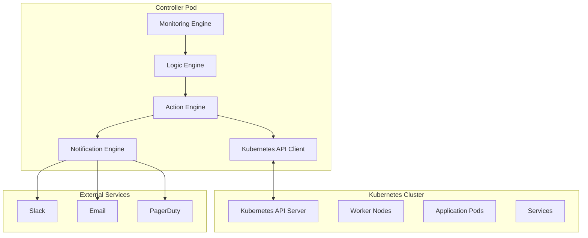

# 🤖 Self-Healing Controller

## Overview

The self-healing controller is a Python-based application that continuously monitors the Kubernetes cluster and automatically recovers from various types of failures. It operates as a Kubernetes deployment with proper RBAC permissions to manage cluster resources.

## Architecture



## Core Components

### 1. Kubernetes API Client
```python
import kubernetes
from kubernetes import client, config

class KubernetesClient:
    def __init__(self):
        # Load in-cluster configuration
        try:
            config.load_incluster_config()
        except config.ConfigException:
            # Fallback to local configuration
            config.load_kube_config()
        
        # Initialize API clients
        self.core_v1 = client.CoreV1Api()
        self.apps_v1 = client.AppsV1Api()
        self.batch_v1 = client.BatchV1Api()
        self.networking_v1 = client.NetworkingV1Api()
        
    def get_nodes(self):
        """Get all cluster nodes"""
        return self.core_v1.list_node()
    
    def get_pods(self, namespace=None):
        """Get pods from namespace or all namespaces"""
        if namespace:
            return self.core_v1.list_namespaced_pod(namespace)
        return self.core_v1.list_pod_for_all_namespaces()
    
    def get_services(self, namespace=None):
        """Get services from namespace or all namespaces"""
        if namespace:
            return self.core_v1.list_namespaced_service(namespace)
        return self.core_v1.list_service_for_all_namespaces()
```

### 2. Monitoring Engine
```python
import time
import threading
from typing import Dict, List

class MonitoringEngine:
    def __init__(self, k8s_client, config):
        self.k8s_client = k8s_client
        self.config = config
        self.monitoring_threads = {}
        self.running = True
    
    def start_monitoring(self):
        """Start all monitoring threads"""
        monitors = [
            ('nodes', self.monitor_nodes),
            ('pods', self.monitor_pods),
            ('services', self.monitor_services),
            ('deployments', self.monitor_deployments)
        ]
        
        for name, monitor_func in monitors:
            thread = threading.Thread(target=monitor_func, name=f"monitor-{name}")
            thread.daemon = True
            thread.start()
            self.monitoring_threads[name] = thread
    
    def monitor_nodes(self):
        """Monitor node health"""
        while self.running:
            try:
                nodes = self.k8s_client.get_nodes()
                
                for node in nodes.items:
                    self.check_node_health(node)
                
                time.sleep(self.config['node_check_interval'])
                
            except Exception as e:
                self.log_error(f"Node monitoring error: {e}")
                time.sleep(30)  # Wait before retry
    
    def monitor_pods(self):
        """Monitor pod health"""
        while self.running:
            try:
                pods = self.k8s_client.get_pods()
                
                for pod in pods.items:
                    self.check_pod_health(pod)
                
                time.sleep(self.config['pod_check_interval'])
                
            except Exception as e:
                self.log_error(f"Pod monitoring error: {e}")
                time.sleep(30)  # Wait before retry
```

### 3. Logic Engine
```python
from enum import Enum
from dataclasses import dataclass
from typing import Optional, List

class FailureType(Enum):
    NODE_FAILURE = "node_failure"
    POD_FAILURE = "pod_failure"
    SERVICE_FAILURE = "service_failure"
    DEPLOYMENT_FAILURE = "deployment_failure"
    RESOURCE_EXHAUSTION = "resource_exhaustion"

class Severity(Enum):
    LOW = "low"
    MEDIUM = "medium"
    HIGH = "high"
    CRITICAL = "critical"

@dataclass
class FailureEvent:
    type: FailureType
    severity: Severity
    resource_name: str
    namespace: str
    description: str
    timestamp: float
    metadata: Dict

class LogicEngine:
    def __init__(self, config):
        self.config = config
        self.failure_history = []
        self.recovery_strategies = self.load_recovery_strategies()
    
    def analyze_failure(self, event: FailureEvent) -> Optional[str]:
        """Analyze failure and determine recovery strategy"""
        # Check failure history for patterns
        similar_failures = self.find_similar_failures(event)
        
        # Determine severity based on impact
        severity = self.calculate_severity(event, similar_failures)
        
        # Select recovery strategy
        strategy = self.select_recovery_strategy(event, severity)
        
        # Log failure event
        self.log_failure_event(event, strategy)
        
        return strategy
    
    def find_similar_failures(self, event: FailureEvent) -> List[FailureEvent]:
        """Find similar failures in history"""
        similar = []
        time_window = 3600  # 1 hour
        
        for failure in self.failure_history:
            if (failure.type == event.type and
                failure.resource_name == event.resource_name and
                event.timestamp - failure.timestamp < time_window):
                similar.append(failure)
        
        return similar
    
    def calculate_severity(self, event: FailureEvent, similar_failures: List[FailureEvent]) -> Severity:
        """Calculate failure severity"""
        # Base severity from failure type
        base_severity = {
            FailureType.NODE_FAILURE: Severity.CRITICAL,
            FailureType.POD_FAILURE: Severity.MEDIUM,
            FailureType.SERVICE_FAILURE: Severity.HIGH,
            FailureType.DEPLOYMENT_FAILURE: Severity.HIGH,
            FailureType.RESOURCE_EXHAUSTION: Severity.MEDIUM
        }
        
        severity = base_severity.get(event.type, Severity.MEDIUM)
        
        # Adjust based on frequency
        if len(similar_failures) > 3:
            severity = Severity.CRITICAL
        elif len(similar_failures) > 1:
            severity = Severity.HIGH
        
        return severity
    
    def select_recovery_strategy(self, event: FailureEvent, severity: Severity) -> str:
        """Select appropriate recovery strategy"""
        strategies = {
            FailureType.NODE_FAILURE: {
                Severity.LOW: "monitor",
                Severity.MEDIUM: "restart",
                Severity.HIGH: "drain_and_replace",
                Severity.CRITICAL: "emergency_replace"
            },
            FailureType.POD_FAILURE: {
                Severity.LOW: "monitor",
                Severity.MEDIUM: "restart",
                Severity.HIGH: "recreate",
                Severity.CRITICAL: "scale_and_replace"
            },
            FailureType.SERVICE_FAILURE: {
                Severity.LOW: "monitor",
                Severity.MEDIUM: "restart",
                Severity.HIGH: "failover",
                Severity.CRITICAL: "emergency_failover"
            }
        }
        
        return strategies.get(event.type, {}).get(severity, "monitor")
```

### 4. Action Engine
```python
import asyncio
from typing import Dict, Any

class ActionEngine:
    def __init__(self, k8s_client, config):
        self.k8s_client = k8s_client
        self.config = config
        self.action_queue = asyncio.Queue()
        self.running = True
    
    async def start_action_processor(self):
        """Start processing action queue"""
        while self.running:
            try:
                action = await self.action_queue.get()
                await self.execute_action(action)
                self.action_queue.task_done()
            except Exception as e:
                self.log_error(f"Action execution error: {e}")
    
    async def execute_action(self, action: Dict[str, Any]):
        """Execute recovery action"""
        action_type = action.get('type')
        resource = action.get('resource')
        strategy = action.get('strategy')
        
        try:
            if action_type == 'node_recovery':
                await self.execute_node_recovery(resource, strategy)
            elif action_type == 'pod_recovery':
                await self.execute_pod_recovery(resource, strategy)
            elif action_type == 'service_recovery':
                await self.execute_service_recovery(resource, strategy)
            else:
                self.log_warning(f"Unknown action type: {action_type}")
                
        except Exception as e:
            self.log_error(f"Action execution failed: {e}")
            await self.handle_action_failure(action, e)
    
    async def execute_node_recovery(self, node, strategy):
        """Execute node recovery action"""
        if strategy == 'monitor':
            await self.monitor_node(node)
        elif strategy == 'restart':
            await self.restart_node(node)
        elif strategy == 'drain_and_replace':
            await self.drain_and_replace_node(node)
        elif strategy == 'emergency_replace':
            await self.emergency_replace_node(node)
    
    async def execute_pod_recovery(self, pod, strategy):
        """Execute pod recovery action"""
        if strategy == 'monitor':
            await self.monitor_pod(pod)
        elif strategy == 'restart':
            await self.restart_pod(pod)
        elif strategy == 'recreate':
            await self.recreate_pod(pod)
        elif strategy == 'scale_and_replace':
            await self.scale_and_replace_pod(pod)
    
    async def drain_and_replace_node(self, node):
        """Drain node and replace it"""
        node_name = node.metadata.name
        
        # Step 1: Cordon the node
        await self.cordon_node(node_name)
        
        # Step 2: Drain the node
        await self.drain_node(node_name)
        
        # Step 3: Wait for pods to be rescheduled
        await self.wait_for_pod_rescheduling(node_name)
        
        # Step 4: Replace the node
        await self.replace_node(node_name)
        
        # Step 5: Verify replacement
        await self.verify_node_replacement(node_name)
```

### 5. Notification Engine
```python
import requests
import smtplib
from email.mime.text import MIMEText
from typing import List, Dict

class NotificationEngine:
    def __init__(self, config):
        self.config = config
        self.slack_webhook = config.get('slack_webhook_url')
        self.email_config = config.get('email', {})
        self.pagerduty_config = config.get('pagerduty', {})
    
    def send_notification(self, event: FailureEvent, action: str, result: str):
        """Send notification about failure and recovery"""
        message = self.format_notification_message(event, action, result)
        
        # Send to different channels based on severity
        if event.severity in [Severity.HIGH, Severity.CRITICAL]:
            self.send_slack_notification(message, channel='#incidents')
            self.send_email_notification(message, recipients=['oncall@company.com'])
            
            if event.severity == Severity.CRITICAL:
                self.send_pagerduty_alert(message)
        else:
            self.send_slack_notification(message, channel='#monitoring')
    
    def format_notification_message(self, event: FailureEvent, action: str, result: str) -> str:
        """Format notification message"""
        return f"""
🚨 **Self-Healing Alert**

**Failure Type:** {event.type.value}
**Resource:** {event.resource_name}
**Namespace:** {event.namespace}
**Severity:** {event.severity.value}
**Description:** {event.description}

**Recovery Action:** {action}
**Result:** {result}

**Timestamp:** {event.timestamp}
        """.strip()
    
    def send_slack_notification(self, message: str, channel: str = '#monitoring'):
        """Send Slack notification"""
        if not self.slack_webhook:
            return
        
        payload = {
            'channel': channel,
            'text': message,
            'username': 'Self-Healing Bot',
            'icon_emoji': ':robot_face:'
        }
        
        try:
            response = requests.post(self.slack_webhook, json=payload)
            response.raise_for_status()
        except Exception as e:
            self.log_error(f"Slack notification failed: {e}")
    
    def send_email_notification(self, message: str, recipients: List[str]):
        """Send email notification"""
        if not self.email_config:
            return
        
        try:
            msg = MIMEText(message)
            msg['Subject'] = 'Self-Healing Alert'
            msg['From'] = self.email_config.get('from')
            msg['To'] = ', '.join(recipients)
            
            with smtplib.SMTP(self.email_config.get('smtp_server')) as server:
                if self.email_config.get('use_tls'):
                    server.starttls()
                
                if self.email_config.get('username'):
                    server.login(
                        self.email_config.get('username'),
                        self.email_config.get('password')
                    )
                
                server.send_message(msg)
                
        except Exception as e:
            self.log_error(f"Email notification failed: {e}")
```

## Configuration

### Environment Variables
```yaml
# kubernetes/self-healing/deployment.yaml
env:
- name: HEALTH_CHECK_INTERVAL
  value: "30"
- name: NODE_FAILURE_THRESHOLD
  value: "3"
- name: POD_RESTART_THRESHOLD
  value: "5"
- name: SLACK_WEBHOOK_URL
  valueFrom:
    secretKeyRef:
      name: slack-secret
      key: webhook-url
- name: EMAIL_SMTP_SERVER
  value: "smtp.gmail.com"
- name: EMAIL_USERNAME
  valueFrom:
    secretKeyRef:
      name: email-secret
      key: username
- name: EMAIL_PASSWORD
  valueFrom:
    secretKeyRef:
      name: email-secret
      key: password
```

### ConfigMap Configuration
```yaml
# kubernetes/self-healing/config.yaml
apiVersion: v1
kind: ConfigMap
metadata:
  name: self-healing-config
  namespace: self-healing
data:
  health_check_interval: "30"
  node_failure_threshold: "3"
  pod_restart_threshold: "5"
  recovery_timeout: "300"
  notification_enabled: "true"
  slack_channel: "#monitoring"
  email_recipients: "team@company.com"
  pagerduty_enabled: "true"
```

## Deployment

### Kubernetes Deployment
```yaml
# kubernetes/self-healing/deployment.yaml
apiVersion: apps/v1
kind: Deployment
metadata:
  name: self-healing-controller
  namespace: self-healing
  labels:
    app: self-healing-controller
spec:
  replicas: 1
  selector:
    match_labels:
      app: self-healing-controller
  template:
    metadata:
      labels:
        app: self-healing-controller
    spec:
      serviceAccountName: self-healing-sa
      containers:
      - name: controller
        image: self-healing-controller:latest
        imagePullPolicy: Always
        env:
        - name: HEALTH_CHECK_INTERVAL
          value: "30"
        - name: NODE_FAILURE_THRESHOLD
          value: "3"
        - name: POD_RESTART_THRESHOLD
          value: "5"
        resources:
          requests:
            memory: "128Mi"
            cpu: "100m"
          limits:
            memory: "256Mi"
            cpu: "200m"
        livenessProbe:
          httpGet:
            path: /health
            port: 8080
          initialDelaySeconds: 30
          periodSeconds: 10
        readinessProbe:
          httpGet:
            path: /ready
            port: 8080
          initialDelaySeconds: 5
          periodSeconds: 5
        ports:
        - containerPort: 8080
          name: http
```

### Service Account and RBAC
```yaml
# kubernetes/self-healing/rbac.yaml
apiVersion: v1
kind: ServiceAccount
metadata:
  name: self-healing-sa
  namespace: self-healing
---
apiVersion: rbac.authorization.k8s.io/v1
kind: ClusterRole
metadata:
  name: self-healing-role
rules:
- apiGroups: [""]
  resources: ["pods", "nodes", "services", "events", "endpoints"]
  verbs: ["get", "list", "watch", "create", "update", "patch", "delete"]
- apiGroups: ["apps"]
  resources: ["deployments", "replicasets", "statefulsets"]
  verbs: ["get", "list", "watch", "create", "update", "patch", "delete"]
- apiGroups: ["batch"]
  resources: ["jobs", "cronjobs"]
  verbs: ["get", "list", "watch", "create", "update", "patch", "delete"]
- apiGroups: ["networking.k8s.io"]
  resources: ["networkpolicies"]
  verbs: ["get", "list", "watch", "create", "update", "patch", "delete"]
---
apiVersion: rbac.authorization.k8s.io/v1
kind: ClusterRoleBinding
metadata:
  name: self-healing-binding
subjects:
- kind: ServiceAccount
  name: self-healing-sa
  namespace: self-healing
roleRef:
  kind: ClusterRole
  name: self-healing-role
  apiGroup: rbac.authorization.k8s.io
```

## Monitoring and Metrics

### Health Endpoints
```python
from flask import Flask, jsonify
import psutil

app = Flask(__name__)

@app.route('/health')
def health():
    """Health check endpoint"""
    return jsonify({
        'status': 'healthy',
        'timestamp': time.time(),
        'uptime': time.time() - start_time
    })

@app.route('/ready')
def ready():
    """Readiness check endpoint"""
    return jsonify({
        'status': 'ready',
        'k8s_connection': k8s_client.is_connected(),
        'monitoring_active': monitoring_engine.is_active()
    })

@app.route('/metrics')
def metrics():
    """Prometheus metrics endpoint"""
    return jsonify({
        'failures_detected': len(failure_history),
        'recoveries_successful': successful_recoveries,
        'recoveries_failed': failed_recoveries,
        'cpu_usage': psutil.cpu_percent(),
        'memory_usage': psutil.virtual_memory().percent
    })
```

### Prometheus Metrics
```python
from prometheus_client import Counter, Histogram, Gauge

# Metrics
failures_detected = Counter('self_healing_failures_detected_total', 'Total failures detected', ['type', 'severity'])
recoveries_attempted = Counter('self_healing_recoveries_attempted_total', 'Total recovery attempts', ['type', 'strategy'])
recovery_duration = Histogram('self_healing_recovery_duration_seconds', 'Recovery duration in seconds', ['type'])
active_failures = Gauge('self_healing_active_failures', 'Currently active failures', ['type'])

def record_failure(event: FailureEvent):
    """Record failure metrics"""
    failures_detected.labels(type=event.type.value, severity=event.severity.value).inc()
    active_failures.labels(type=event.type.value).inc()

def record_recovery(event: FailureEvent, strategy: str, duration: float):
    """Record recovery metrics"""
    recoveries_attempted.labels(type=event.type.value, strategy=strategy).inc()
    recovery_duration.labels(type=event.type.value).observe(duration)
    active_failures.labels(type=event.type.value).dec()
```

## Testing

### Unit Tests
```python
import unittest
from unittest.mock import Mock, patch

class TestSelfHealingController(unittest.TestCase):
    def setUp(self):
        self.k8s_client = Mock()
        self.config = {
            'health_check_interval': 30,
            'node_failure_threshold': 3,
            'pod_restart_threshold': 5
        }
        self.controller = SelfHealingController(self.k8s_client, self.config)
    
    def test_node_health_check(self):
        """Test node health check functionality"""
        # Mock node with failure
        failed_node = Mock()
        failed_node.status.conditions = [
            Mock(type="Ready", status="False")
        ]
        
        # Test health check
        result = self.controller.check_node_health(failed_node)
        self.assertTrue(result.is_failed)
    
    def test_pod_recovery(self):
        """Test pod recovery functionality"""
        # Mock failed pod
        failed_pod = Mock()
        failed_pod.status.phase = "Failed"
        
        # Test recovery
        result = self.controller.recover_pod(failed_pod)
        self.assertTrue(result.success)
```

### Integration Tests
```python
class TestIntegration(unittest.TestCase):
    def setUp(self):
        self.test_cluster = TestKubernetesCluster()
        self.controller = SelfHealingController(self.test_cluster.client, self.config)
    
    def test_complete_recovery_workflow(self):
        """Test complete recovery workflow"""
        # Create test scenario
        scenario = self.create_failure_scenario()
        
        # Execute recovery
        result = self.controller.handle_failure(scenario)
        
        # Verify results
        self.assertTrue(result.success)
        self.assertLess(result.recovery_time, 300)  # 5 minutes
        self.assertTrue(result.verification_passed)
```

## Troubleshooting

### Common Issues

#### 1. Permission Denied
```bash
# Check RBAC permissions
kubectl auth can-i get pods --as=system:serviceaccount:self-healing:self-healing-sa
kubectl auth can-i delete pods --as=system:serviceaccount:self-healing:self-healing-sa
```

#### 2. API Connection Issues
```python
# Check API connectivity
try:
    nodes = k8s_client.get_nodes()
    print(f"Connected to {len(nodes)} nodes")
except Exception as e:
    print(f"Connection failed: {e}")
```

#### 3. Resource Exhaustion
```python
# Monitor resource usage
import psutil

cpu_usage = psutil.cpu_percent()
memory_usage = psutil.virtual_memory().percent

if cpu_usage > 80 or memory_usage > 80:
    print(f"High resource usage: CPU {cpu_usage}%, Memory {memory_usage}%")
```

### Debug Mode
```python
# Enable debug logging
import logging
logging.basicConfig(level=logging.DEBUG)

# Enable verbose output
config['debug_mode'] = True
config['verbose_logging'] = True
```

## Performance Optimization

### 1. Efficient API Usage
```python
# Use field selectors to reduce data transfer
pods = k8s_client.core_v1.list_pod_for_all_namespaces(
    field_selector='status.phase=Failed'
)

# Use label selectors for targeted queries
pods = k8s_client.core_v1.list_pod_for_all_namespaces(
    label_selector='app=critical-app'
)
```

### 2. Caching
```python
import functools
import time

@functools.lru_cache(maxsize=128)
def get_node_info(node_name: str):
    """Cache node information"""
    return k8s_client.get_node(node_name)

# Cache with TTL
class TTLCache:
    def __init__(self, ttl=300):
        self.cache = {}
        self.ttl = ttl
    
    def get(self, key):
        if key in self.cache:
            value, timestamp = self.cache[key]
            if time.time() - timestamp < self.ttl:
                return value
            else:
                del self.cache[key]
        return None
    
    def set(self, key, value):
        self.cache[key] = (value, time.time())
```

### 3. Connection Pooling
```python
# Configure connection pooling
from kubernetes import client

configuration = client.Configuration()
configuration.connection_pool_maxsize = 20
configuration.connection_pool_connections = 10

api_client = client.ApiClient(configuration)
core_v1 = client.CoreV1Api(api_client)
```
