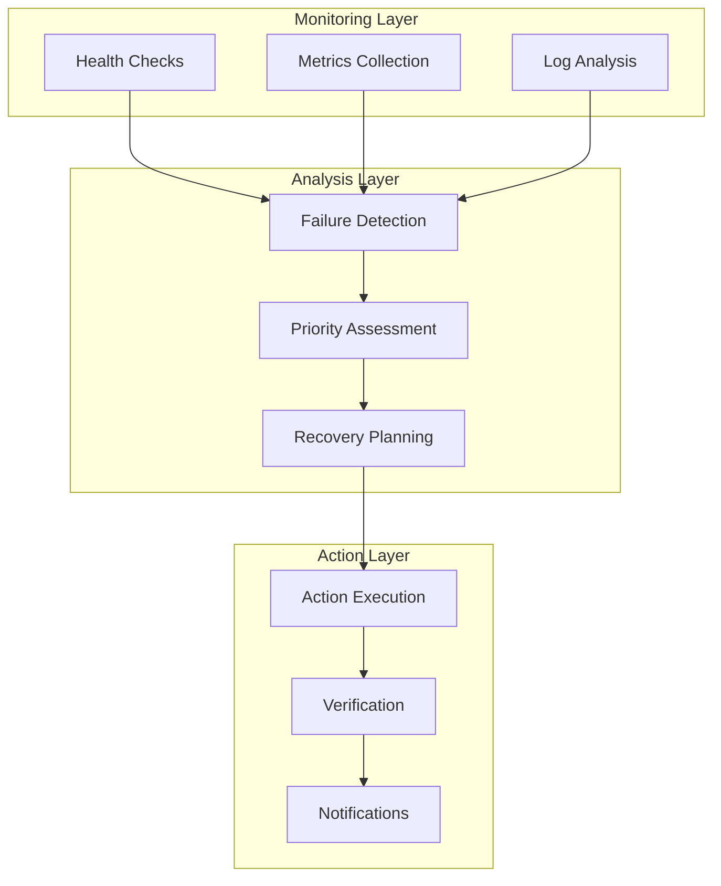

# 🔄 Self-Healing Logic

## Overview

The self-healing system is designed to automatically detect and recover from various types of failures in the Kubernetes cluster. It operates continuously, monitoring the cluster state and taking proactive actions to maintain system health.

## Core Principles

### 1. Proactive Monitoring
- **Continuous Health Checks**: Regular monitoring of all cluster components
- **Early Detection**: Identify issues before they impact users
- **Predictive Analysis**: Use metrics to predict potential failures

### 2. Automated Recovery
- **Immediate Response**: Quick recovery actions for critical failures
- **Gradual Escalation**: Progressive recovery strategies
- **Fallback Mechanisms**: Multiple recovery options for complex failures

### 3. Minimal Disruption
- **Rolling Updates**: Zero-downtime deployments
- **Graceful Degradation**: Maintain service with reduced functionality
- **User Experience**: Prioritize user-facing service availability

## Architecture



## Health Check Types

### 1. Node Health Checks
```python
def check_node_health(self):
    """Monitor node status and health"""
    nodes = self.k8s_client.list_node()
    
    for node in nodes.items:
        # Check node conditions
        for condition in node.status.conditions:
            if condition.type == "Ready" and condition.status == "False":
                self.handle_node_failure(node)
            
            if condition.type == "MemoryPressure" and condition.status == "True":
                self.handle_memory_pressure(node)
            
            if condition.type == "DiskPressure" and condition.status == "True":
                self.handle_disk_pressure(node)
```

### 2. Pod Health Checks
```python
def check_pod_health(self):
    """Monitor pod status and restart counts"""
    pods = self.k8s_client.list_pod_for_all_namespaces()
    
    for pod in pods.items:
        # Check pod phase
        if pod.status.phase == "Failed":
            self.handle_pod_failure(pod)
        
        # Check restart count
        for container in pod.status.container_statuses:
            if container.restart_count > self.pod_restart_threshold:
                self.handle_pod_restart_failure(pod, container)
        
        # Check readiness
        if not pod.status.ready:
            self.handle_pod_not_ready(pod)
```

### 3. Service Health Checks
```python
def check_service_health(self):
    """Monitor service availability and endpoints"""
    services = self.k8s_client.list_service_for_all_namespaces()
    
    for service in services.items:
        # Check if service has endpoints
        endpoints = self.k8s_client.read_namespaced_endpoints(
            name=service.metadata.name,
            namespace=service.metadata.namespace
        )
        
        if not endpoints.subsets or not endpoints.subsets[0].addresses:
            self.handle_service_no_endpoints(service)
        
        # Check service connectivity
        if not self.test_service_connectivity(service):
            self.handle_service_connectivity_issue(service)
```

## Failure Detection Logic

### 1. Pattern Recognition
```python
def detect_failure_patterns(self):
    """Identify common failure patterns"""
    patterns = {
        'cascading_failure': self.detect_cascading_failure(),
        'resource_exhaustion': self.detect_resource_exhaustion(),
        'network_partition': self.detect_network_partition(),
        'storage_issues': self.detect_storage_issues()
    }
    
    for pattern_name, detected in patterns.items():
        if detected:
            self.handle_failure_pattern(pattern_name)
```

### 2. Threshold Monitoring
```python
def monitor_thresholds(self):
    """Monitor resource and performance thresholds"""
    thresholds = {
        'cpu_usage': 80,  # percentage
        'memory_usage': 85,  # percentage
        'disk_usage': 90,  # percentage
        'response_time': 1000,  # milliseconds
        'error_rate': 5  # percentage
    }
    
    for metric, threshold in thresholds.items():
        current_value = self.get_current_metric(metric)
        if current_value > threshold:
            self.handle_threshold_exceeded(metric, current_value, threshold)
```

### 3. Anomaly Detection
```python
def detect_anomalies(self):
    """Detect unusual patterns in metrics"""
    metrics = self.get_historical_metrics()
    
    for metric_name, values in metrics.items():
        # Calculate baseline
        baseline = self.calculate_baseline(values)
        
        # Detect anomalies
        current_value = values[-1]
        if self.is_anomaly(current_value, baseline):
            self.handle_anomaly(metric_name, current_value, baseline)
```

## Recovery Actions

### 1. Node Recovery
```python
def handle_node_failure(self, node):
    """Handle node failure recovery"""
    try:
        # Step 1: Cordon the node
        self.cordon_node(node.metadata.name)
        
        # Step 2: Drain the node
        self.drain_node(node.metadata.name)
        
        # Step 3: Check if node can be recovered
        if self.can_recover_node(node):
            self.recover_node(node)
        else:
            # Step 4: Replace the node
            self.replace_node(node)
        
        # Step 5: Verify recovery
        self.verify_node_recovery(node)
        
    except Exception as e:
        self.send_alert(f"Node recovery failed: {e}")
        self.escalate_node_failure(node)
```

### 2. Pod Recovery
```python
def handle_pod_failure(self, pod):
    """Handle pod failure recovery"""
    try:
        # Step 1: Analyze failure reason
        reason = self.analyze_pod_failure(pod)
        
        # Step 2: Choose recovery strategy
        if reason == "OOMKilled":
            self.handle_oom_failure(pod)
        elif reason == "CrashLoopBackOff":
            self.handle_crash_loop(pod)
        elif reason == "ImagePullBackOff":
            self.handle_image_pull_failure(pod)
        else:
            self.handle_generic_pod_failure(pod)
        
        # Step 3: Verify recovery
        self.verify_pod_recovery(pod)
        
    except Exception as e:
        self.send_alert(f"Pod recovery failed: {e}")
        self.escalate_pod_failure(pod)
```

### 3. Service Recovery
```python
def handle_service_failure(self, service):
    """Handle service failure recovery"""
    try:
        # Step 1: Check service dependencies
        dependencies = self.get_service_dependencies(service)
        
        # Step 2: Verify dependencies are healthy
        for dep in dependencies:
            if not self.is_service_healthy(dep):
                self.recover_service(dep)
        
        # Step 3: Restart service if needed
        if not self.is_service_healthy(service):
            self.restart_service(service)
        
        # Step 4: Verify service recovery
        self.verify_service_recovery(service)
        
    except Exception as e:
        self.send_alert(f"Service recovery failed: {e}")
        self.escalate_service_failure(service)
```

## Recovery Strategies

### 1. Restart Strategy
```python
def restart_strategy(self, resource):
    """Implement restart strategy for failed resources"""
    max_restarts = 3
    restart_delay = 30  # seconds
    
    for attempt in range(max_restarts):
        try:
            self.restart_resource(resource)
            time.sleep(restart_delay)
            
            if self.is_resource_healthy(resource):
                return True
                
        except Exception as e:
            self.log_error(f"Restart attempt {attempt + 1} failed: {e}")
    
    return False
```

### 2. Scaling Strategy
```python
def scaling_strategy(self, deployment):
    """Implement scaling strategy for resource issues"""
    current_replicas = deployment.spec.replicas
    max_replicas = 10
    
    # Scale up if under load
    if self.is_under_load(deployment):
        new_replicas = min(current_replicas * 2, max_replicas)
        self.scale_deployment(deployment, new_replicas)
    
    # Scale down if over-provisioned
    elif self.is_over_provisioned(deployment):
        new_replicas = max(current_replicas // 2, 1)
        self.scale_deployment(deployment, new_replicas)
```

### 3. Failover Strategy
```python
def failover_strategy(self, service):
    """Implement failover strategy for critical services"""
    # Check primary instance
    if not self.is_primary_healthy(service):
        # Switch to secondary
        self.switch_to_secondary(service)
        
        # Start recovery of primary
        self.recover_primary(service)
        
        # Switch back when primary is ready
        if self.is_primary_healthy(service):
            self.switch_to_primary(service)
```

## Verification and Validation

### 1. Health Verification
```python
def verify_recovery(self, resource):
    """Verify that recovery was successful"""
    verification_steps = [
        self.verify_resource_status,
        self.verify_resource_connectivity,
        self.verify_resource_performance,
        self.verify_resource_dependencies
    ]
    
    for step in verification_steps:
        if not step(resource):
            return False
    
    return True
```

### 2. Performance Validation
```python
def validate_performance(self, resource):
    """Validate performance after recovery"""
    metrics = self.get_performance_metrics(resource)
    
    # Check response time
    if metrics['response_time'] > self.performance_thresholds['response_time']:
        return False
    
    # Check throughput
    if metrics['throughput'] < self.performance_thresholds['throughput']:
        return False
    
    # Check error rate
    if metrics['error_rate'] > self.performance_thresholds['error_rate']:
        return False
    
    return True
```

## Notification System

### 1. Alert Levels
```python
def send_alert(self, message, level="info"):
    """Send alerts based on severity level"""
    alert_configs = {
        "info": {
            "slack_channel": "#monitoring",
            "email_recipients": ["team@company.com"]
        },
        "warning": {
            "slack_channel": "#alerts",
            "email_recipients": ["oncall@company.com"]
        },
        "critical": {
            "slack_channel": "#incidents",
            "email_recipients": ["emergency@company.com"],
            "pagerduty": True
        }
    }
    
    config = alert_configs.get(level, alert_configs["info"])
    
    # Send Slack notification
    self.send_slack_notification(message, config["slack_channel"])
    
    # Send email notification
    self.send_email_notification(message, config["email_recipients"])
    
    # Send PagerDuty alert for critical issues
    if level == "critical" and config.get("pagerduty"):
        self.send_pagerduty_alert(message)
```

### 2. Escalation Procedures
```python
def escalate_issue(self, issue, level=1):
    """Escalate issues that cannot be automatically resolved"""
    escalation_configs = {
        1: {
            "timeout": 300,  # 5 minutes
            "notify": ["oncall@company.com"]
        },
        2: {
            "timeout": 900,  # 15 minutes
            "notify": ["manager@company.com"]
        },
        3: {
            "timeout": 1800,  # 30 minutes
            "notify": ["director@company.com"]
        }
    }
    
    config = escalation_configs.get(level, escalation_configs[3])
    
    # Set escalation timer
    self.set_escalation_timer(issue, config["timeout"])
    
    # Send escalation notification
    self.send_escalation_notification(issue, config["notify"])
```

## Configuration Management

### 1. Dynamic Configuration
```python
def load_configuration(self):
    """Load configuration from ConfigMap"""
    config_map = self.k8s_client.read_namespaced_config_map(
        name="self-healing-config",
        namespace="self-healing"
    )
    
    self.config = {
        "health_check_interval": int(config_map.data.get("health_check_interval", "30")),
        "node_failure_threshold": int(config_map.data.get("node_failure_threshold", "3")),
        "pod_restart_threshold": int(config_map.data.get("pod_restart_threshold", "5")),
        "recovery_timeout": int(config_map.data.get("recovery_timeout", "300")),
        "notification_enabled": config_map.data.get("notification_enabled", "true").lower() == "true"
    }
```

### 2. Configuration Validation
```python
def validate_configuration(self, config):
    """Validate configuration parameters"""
    validation_rules = {
        "health_check_interval": lambda x: 10 <= x <= 300,
        "node_failure_threshold": lambda x: 1 <= x <= 10,
        "pod_restart_threshold": lambda x: 1 <= x <= 20,
        "recovery_timeout": lambda x: 60 <= x <= 1800
    }
    
    for param, rule in validation_rules.items():
        if param in config and not rule(config[param]):
            raise ValueError(f"Invalid configuration for {param}: {config[param]}")
```

## Performance Optimization

### 1. Efficient Monitoring
```python
def optimize_monitoring(self):
    """Optimize monitoring for performance"""
    # Use efficient API calls
    self.use_field_selectors()
    self.use_label_selectors()
    
    # Implement caching
    self.cache_node_info()
    self.cache_pod_info()
    
    # Use watch API for real-time updates
    self.use_watch_api()
```

### 2. Resource Management
```python
def manage_resources(self):
    """Manage controller resources efficiently"""
    # Limit concurrent operations
    self.limit_concurrent_operations(10)
    
    # Implement rate limiting
    self.implement_rate_limiting()
    
    # Use connection pooling
    self.use_connection_pooling()
```

## Testing and Validation

### 1. Unit Tests
```python
def test_health_check(self):
    """Test health check functionality"""
    # Mock Kubernetes API
    mock_k8s = MockKubernetesAPI()
    
    # Test node health check
    result = self.check_node_health(mock_k8s)
    assert result is not None
    
    # Test pod health check
    result = self.check_pod_health(mock_k8s)
    assert result is not None
```

### 2. Integration Tests
```python
def test_recovery_workflow(self):
    """Test complete recovery workflow"""
    # Create test scenario
    scenario = self.create_test_scenario()
    
    # Execute recovery
    result = self.execute_recovery(scenario)
    
    # Verify results
    assert result.success
    assert result.recovery_time < 300  # 5 minutes
    assert result.verification_passed
```

## Monitoring and Metrics

### 1. Key Metrics
- **Recovery Time**: Time to recover from failures
- **Success Rate**: Percentage of successful recoveries
- **False Positives**: Incorrect failure detections
- **Resource Usage**: CPU and memory consumption

### 2. Dashboards
- **Recovery Dashboard**: Real-time recovery status
- **Performance Dashboard**: System performance metrics
- **Alert Dashboard**: Active alerts and notifications
- **History Dashboard**: Historical recovery data
